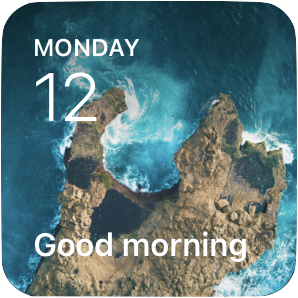

    

# Awesome Scriptable

A curated list of awesome [Scriptable](https://docs.scriptable.app/) resources and scripts

Scriptable Documentation: https://docs.scriptable.app/

Scriptable TestFlight Link: https://testflight.apple.com/join/uN1vTqxk

---

### Widgets:

- [Spotify Now Playing](https://gist.github.com/marco79cgn/79a6a265d978dc22cc2a12058b24e02b) by [@marco79cgn](https://github.com/marco79cgn)  
***

- [Date and Greeting with Unsplash Collection Background](https://gist.github.com/cassianomon/efffbe09d20013986cd4ffc0f362a3e2) by [@cassianomon](https://github.com/cassianomon)  

***

- [TeslaFi Widget](https://github.com/DrieStone/TeslaFi-Widget) by [@driestone](https://github.com/driestone)  

***

- [Customizable Calendar](https://gist.github.com/rudotriton/b51d227c3d1d9cb497829ae45583224f) by [@rudotriton](https://github.com/rudotriton)

***

- [PurpleAir-AQI-Scriptable-Widget](https://github.com/jasonsnell/PurpleAir-AQI-Scriptable-Widget) by [@jasonsell](https://github.com/jasonsnell)

***

- [GitLab Stats Widget](https://github.com/p0fi/gitlab-stats-for-scribtable) by [@p0fi](https://github.com/p0fi)
